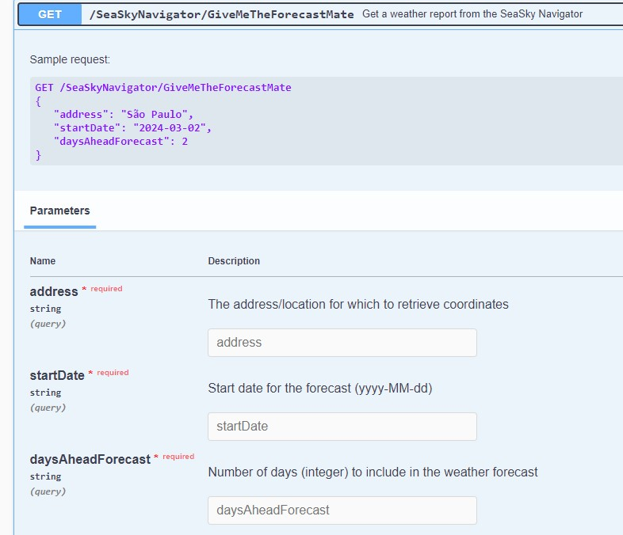

# SeaSky Navigator

## Table of Contents

- [Introduction](#introduction)
- [APIs Used](#apis-used)
- [App Overview](#app-overview)
- [App .CS Files](#app-cs-files)
- [FrontEnd](#front-end)
- [BackEnd](#back-end)
- [Future Improvements](#future-improvements)

## Introduction
This small project started as a simple way I found to have a little more practice in the C# programming language. The initial idea was to gain practical experience in consuming publicly available REST APIs on a .NET framework and to start building a portfolio to consolidate and showcase some of the skills that I've been studying recently.
  
Naming it "SeaSky Navigator," the core idea of the app is simple and perhaps a project that many beginners may have undertaken at some point in their study journey: an app that provides weather predictions.
  
There is a little twist to this one, though. The app is using the capabilities of an LLM (specifically, the ChatGPT 3.5 Turbo from OpenAI) to deliver the weather report in pirate speak. It is done in good fun and helped me feel a little more comfortable using the .NET environment and with Object-Oriented Programming (OOP) in C#.

## APIs Used
- [Open-Meteo](https://open-meteo.com/): for weather forecasts
- [Position Stack](https://positionstack.com/): for coordinates
- [OpenAI](https://openai.com/): for LLM capabilities

## App Overview
As a beginner, I've decided to start using a public API for weather forecasts, **Open-Meteo**, to build a simple console app in which the user would input the desired location and the number of days to get the weather forecast.
  
However, to obtain predictions from the Open-Meteo API, one needs to pass the coordinates of both latitude and longitude in the request method. It would be inconvenient for the user to search for these coordinates elsewhere and then pass them to the app. To solve this issue, the app is designed to use another free API from PositionStack to get the coordinates from the user's input.
  

  
After obtaining the location's coordinates returned by the **Position Stack**'s API (and checking if the location is valid), the next step is to ask the user for a date and how many days from that date they want to receive their weather forecast. For example, specifying "2024-02-26" and "2 days" would mean returning a report on the forecast for the days ranging from "2024-02-26" to "2024-02-28.  
In this part, there's also a check to see if the user has provided a valid date, meaning it has to be in the format "yyyy-MM-dd," and also to see if the range of dates they want doesn't exceed 9 days from the current day (not the date they inputted). The limit of 9 days from the current date is to prevent the app from returning null values for forecasts on days further into the future.
  

  
With this information on hand, the app will then call the Open-Meteo API to get the JSON response on the forecast values. Currently, the app is receiving data on temperature, apparent temperature, relative humidity, and precipitation probability to build its report. 
In the earlier stages of the app, these weather data would only be printed in a tabular-like form on the console, but it seemed like an uninteresting way to present this information. So, the app is instructed to call the **OpenAI** API to use the ChatGPT 3.5 Turbo (the model can be changed) and feed it first with an initial prompt instructing the language model that it will receive a string containing weather-related data and that it should use that data to generate an answer in pirate speak, giving the user a summarized forecast for each day they requested. The connection to the OpenAI API is established using an unofficial NuGet package called OpenAI by OkGoDolt.
  

  
After this, the app asks the user if they want to get another forecast or quit. If they ask for another forecast, then the entire process of asking for the location, dates, etc., will be restarted.
 

In summary, the app's flow looks something like this:
 

## App .CS Files
### WeatherService.cs
This file contains the WeatherService class, which implements the IDisposable interface. It is responsible for using an HttpClient instance to make an asynchronous request to the Open-Meteo API, fetching forecast data.

### WeatherForecast.cs
Within this file, you'll find the code for the WeatherForecast class, HourlyUnits, and, notably, the Hourly class. These classes are designed to store the data received from the Open-Meteo API.

### CoordinatesGetter.cs
This file holds the code for the CoordinatesGetter class, which implements the IDisposable interface. Similar to the WeatherService class, it utilizes an HttpClient instance to make a call to the PositionStack API. To function correctly, an API key must be set in the environment variables (POSITIONSTACK_API_KEY).

### LLMChat.cs
Contained in this file is the LLMChat class, used to initialize a conversation instance with an LLM model. It facilitates feeding data to obtain a summarized final report. To function correctly, an API key must be set in the environment variables (OPENAI_API_KEY).

## Front End
To enhance the user experience, a user-friendly web page has been developed using HTML, CSS, and JavaScript. The page allows users to input location and dates for their desired forecast. Subsequently, this information is sent to the backend API to retrieve the forecast text, as explained in previous sections.

## Back End
The backend comprises a straightforward API with a single route designed to handle GET requests when users submit data for forecasting. The API processes the logic outlined in the App Overview section and returns the weather forecast text generated by the LLM.

## Future Improvements
As my first project on a .NET framework and with the C# language, this project has room for improvements and corrections that I would like to implement in the future. These include:

- Removal of warnings on null references: Currently, null references are not handled extensively in the code. Addressing this will enhance the overall robustness of the application.

- Handling of exceptions: While there are checks for formats and valid values, exception handling for scenarios like an empty response from the APIs is not implemented yet. Incorporating proper exception handling will contribute to better error management.

- Better structuring and organization of code: In the current state, some functions in Program.cs could potentially be better organized into separate files for helper methods. This restructuring will improve code readability and maintainability.

